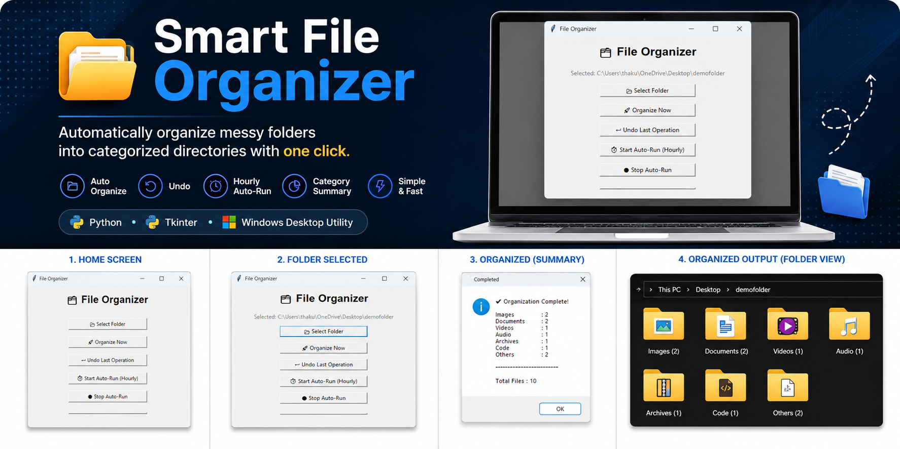
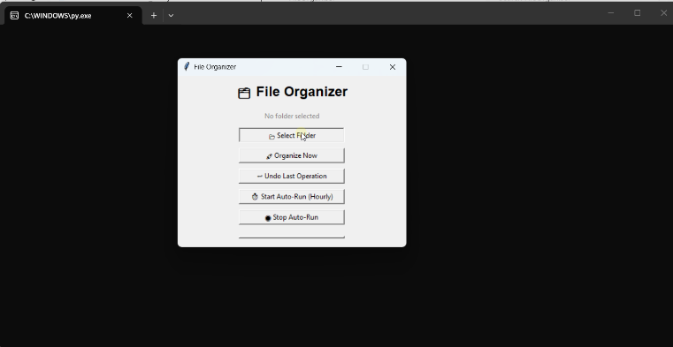
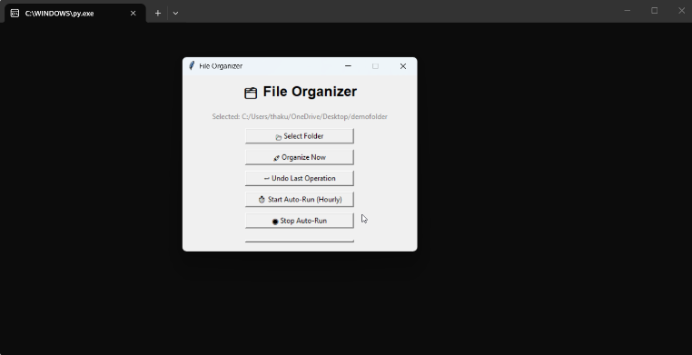
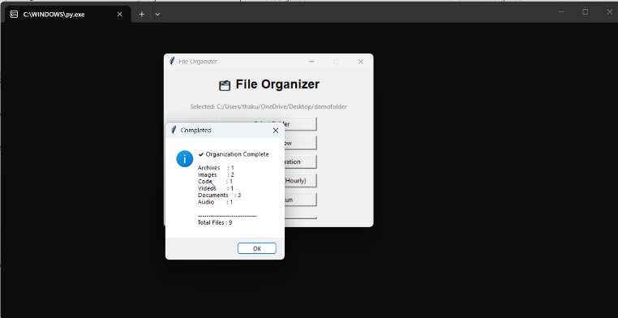

#  📂Smart File Organizer
<p align="center">
  
</p>

<br>
> Automatically organize messy folders into categorized directories with one click.


---

## 📖 About

Smart File Organizer is a lightweight desktop application built using **Python** and **Tkinter** that automatically organizes files into categorized folders based on their file extensions.

The application helps users keep folders like **Downloads**, **Desktop**, and **Documents** clean by sorting files into dedicated folders such as Images, Videos, Documents, Audio, Archives, Code, Executables, and Others.

In addition to automatic file organization, the application also provides an **Undo** feature that restores files to their original locations using a JSON log, as well as an **Hourly Auto-Run** mode for continuous folder organization.

---

# 🎬 Demo

<p align="center">
  
</p>
---

# 📸 Screenshots

## 🏠 Home Screen

<p align="center">
  
</p>

---

## 📁 Folder Selected

<p align="center">
  
</p>
---

## ✅ Organization Complete

<p align="center">
  
</p>
---

# ✨ Features

- 📂 Organize files automatically by file extension
- 🖥️ Simple and user-friendly desktop GUI
- 📁 Automatically creates category folders
- ↩️ Undo last organization
- ⏱️ Hourly automatic organization
- 📊 Category-wise organization summary
- ⚡ Lightweight and fast
- 📝 JSON-based operation logging

---

# 📂 Supported Categories

| Category | Extensions |
|----------|------------|
| 🖼 Images | png, jpg, jpeg, gif, bmp, svg, webp |
| 🎥 Videos | mp4, mkv, avi, mov, wmv, flv |
| 📄 Documents | pdf, docx, doc, txt, pptx, xlsx, odt |
| 🎵 Audio | mp3, wav, aac, flac, ogg |
| 📦 Archives | zip, rar, 7z, tar, gz |
| 💻 Code | py, cpp, c, java, html, css, js, json |
| ⚙ Executables | exe, msi, apk, bat, sh |
| 📁 Others | Any unsupported extension |

---

# ⚙️ Installation

Clone the repository

```bash
git clone https://github.com/thakuraditys1s0/FileOrganiser.git
```

Move into the project directory

```bash
cd FileOrganiser
```

Run the application

```bash
python file_organizer_gui.py
```

---

# 🚀 Usage

1. Launch the application.
2. Click **📂 Select Folder**.
3. Choose the folder you want to organize.
4. Click **🚀 Organize Now**.
5. Files will automatically be categorized into folders.
6. If required, click **↩ Undo Last Operation** to restore the previous state.
7. Enable **⏱ Start Auto-Run** to organize the folder automatically every hour.

---

# 📁 Project Structure

```
FileOrganiser
│
├── assets
│   ├── home.png
│   ├── folder-selected.png
│   ├── organized.png
│   └── demo.gif
│
├── build
│
├── file_organizer_gui.py
├── file_organizer_gui.spec
├── file_organizer_icon.ico
├── organizer_log.json
├── README.md
└── .gitignore
```

---

# 🛠 Technologies Used

- Python
- Tkinter
- JSON
- shutil
- os
- threading
- time

---

# 💡 Future Improvements

- 🌙 Dark Mode
- 📊 Progress Bar
- 📈 File Statistics Dashboard
- 🖱 Drag & Drop Support
- 📂 Custom File Categories
- 🔍 Duplicate File Detection
- ⚙ Settings Panel

---

# 🤝 Contributing

Contributions are welcome.

If you have suggestions or improvements, feel free to fork the repository and submit a Pull Request.

---

# 📜 License

This project is licensed under the MIT License.

---

# 👨‍💻 Author

**Aditya Singh**

GitHub:
https://github.com/thakuraditys1s0

---

⭐ If you found this project useful, consider giving it a Star.
